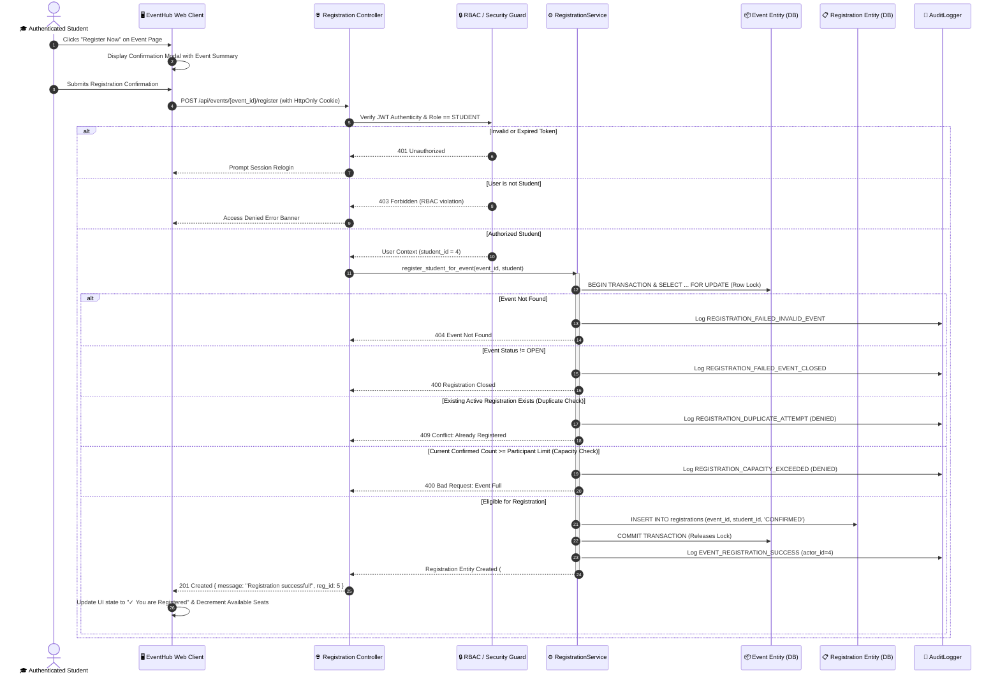

# Scenario-Based Analysis Model: "Register for an Event"

```mermaid
sequenceDiagram
    autonumber
    actor Student as 🎓 Authenticated Student
    participant UI as 🖥️ EventHub Web Client
    participant API as 🌐 Registration Controller
    participant Auth as 🔒 RBAC / Security Guard
    participant Service as ⚙️ RegistrationService
    participant EventRepo as 📦 Event Entity (DB)
    participant RegRepo as 📋 Registration Entity (DB)
    participant Audit as 📜 AuditLogger

    Student->>UI: Clicks "Register Now" on Event Page
    UI->>UI: Display Confirmation Modal with Event Summary
    Student->>UI: Submits Registration Confirmation
    UI->>API: POST /api/events/{event_id}/register (with HttpOnly Cookie)
    
    API->>Auth: Verify JWT Authenticity & Role == STUDENT
    alt Invalid or Expired Token
        Auth-->>API: 401 Unauthorized
        API-->>UI: Prompt Session Relogin
    else User is not Student
        Auth-->>API: 403 Forbidden (RBAC violation)
        API-->>UI: Access Denied Error Banner
    else Authorized Student
        Auth-->>API: User Context (student_id = 4)
        API->>Service: register_student_for_event(event_id, student)
        
        activate Service
        Service->>EventRepo: BEGIN TRANSACTION & SELECT ... FOR UPDATE (Row Lock)
        
        alt Event Not Found
            Service->>Audit: Log REGISTRATION_FAILED_INVALID_EVENT
            Service-->>API: 404 Event Not Found
        else Event Status != OPEN
            Service->>Audit: Log REGISTRATION_FAILED_EVENT_CLOSED
            Service-->>API: 400 Registration Closed
        else Existing Active Registration Exists (Duplicate Check)
            Service->>Audit: Log REGISTRATION_DUPLICATE_ATTEMPT (DENIED)
            Service-->>API: 409 Conflict: Already Registered
        else Current Confirmed Count >= Participant Limit (Capacity Check)
            Service->>Audit: Log REGISTRATION_CAPACITY_EXCEEDED (DENIED)
            Service-->>API: 400 Bad Request: Event Full
        else Eligible for Registration
            Service->>RegRepo: INSERT INTO registrations (event_id, student_id, 'CONFIRMED')
            Service->>EventRepo: COMMIT TRANSACTION (Releases Lock)
            Service->>Audit: Log EVENT_REGISTRATION_SUCCESS (actor_id=4)
            Service-->>API: Registration Entity Created (#REG-0005)
            deactivate Service
            API-->>UI: 201 Created { message: "Registration successful!", reg_id: 5 }
            UI->>UI: Update UI state to "✓ You are Registered" & Decrement Available Seats
        end
    end
```
