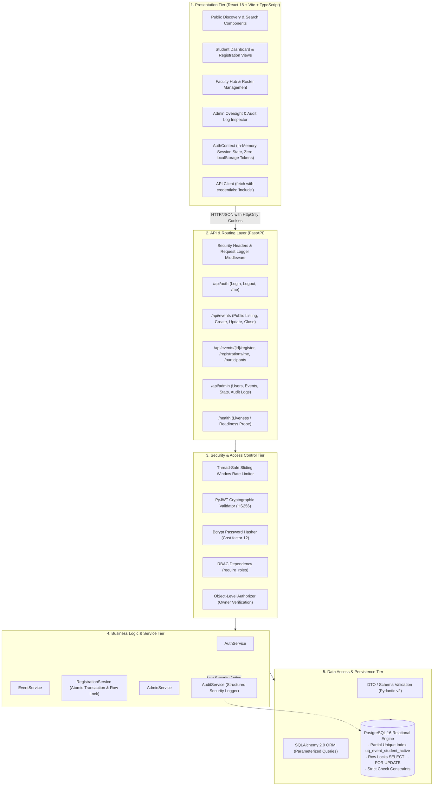

# Layered Application Architecture Diagram

```mermaid
flowchart TD
    subgraph PresentationTier ["1. Presentation Tier (React 18 + Vite + TypeScript)"]
        UI_Guest["Public Discovery & Search Components"]
        UI_Student["Student Dashboard & Registration Views"]
        UI_Faculty["Faculty Hub & Roster Management"]
        UI_Admin["Admin Oversight & Audit Log Inspector"]
        AuthCtx["AuthContext (In-Memory Session State, Zero localStorage Tokens)"]
        ApiClient["API Client (fetch with credentials: 'include')"]
    end

    subgraph APILayer ["2. API & Routing Layer (FastAPI)"]
        SecMiddleware["Security Headers & Request Logger Middleware"]
        AuthRouter["/api/auth (Login, Logout, /me)"]
        EventsRouter["/api/events (Public Listing, Create, Update, Close)"]
        RegRouter["/api/events/{id}/register, /registrations/me, /participants"]
        AdminRouter["/api/admin (Users, Events, Stats, Audit Logs)"]
        HealthRouter["/health (Liveness / Readiness Probe)"]
    end

    subgraph SecurityTier ["3. Security & Access Control Tier"]
        RateLimiter["Thread-Safe Sliding Window Rate Limiter"]
        JWTEngine["PyJWT Cryptographic Validator (HS256)"]
        BcryptModule["Bcrypt Password Hasher (Cost factor 12)"]
        RBACEngine["RBAC Dependency (require_roles)"]
        ObjectAuth["Object-Level Authorizer (Owner Verification)"]
    end

    subgraph ServiceTier ["4. Business Logic & Service Tier"]
        AuthSvc["AuthService"]
        EventSvc["EventService"]
        RegSvc["RegistrationService (Atomic Transaction & Row Lock)"]
        AdminSvc["AdminService"]
        AuditSvc["AuditService (Structured Security Logger)"]
    end

    subgraph DataAccessTier ["5. Data Access & Persistence Tier"]
        PydanticSchemas["DTO / Schema Validation (Pydantic v2)"]
        SQLAlchemyORM["SQLAlchemy 2.0 ORM (Parameterized Queries)"]
        PostgresDB[("PostgreSQL 16 Relational Engine<br/>- Partial Unique Index uq_event_student_active<br/>- Row Locks SELECT ... FOR UPDATE<br/>- Strict Check Constraints")]
    end

    %% Wiring
    PresentationTier -->|"HTTP/JSON with HttpOnly Cookies"| APILayer
    APILayer --> SecurityTier
    SecurityTier --> ServiceTier
    ServiceTier --> DataAccessTier
    DataAccessTier --> PostgresDB
    ServiceTier -.->|"Log Security Action"| AuditSvc
    AuditSvc -.-> PostgresDB
```
