# Attack Tree: Compromise Event Registration Integrity

```mermaid
graph TD
    Root["🎯 ROOT GOAL: Compromise Event Registration Integrity<br/>(OR)"]
    
    %% Branch 1: Unauthorized Registration as Another Student
    B1["1. Unauthorizedly Register or Manipulate Another Student's Registration<br/>(OR)"]
    Root --> B1

    B1_1["1.1 Impersonate Student via Credential Theft<br/>(OR)"]
    B1 --> B1_1
    B1_1_A["1.1.1 Credential Brute-Forcing<br/>[Mitigated: Rate Limiter 5 req/min]"]
    B1_1_B["1.1.2 Weak Password Cracking<br/>[Mitigated: Bcrypt 12 rounds]"]
    B1_1_C["1.1.3 Token Theft via XSS / Storage Scraping<br/>[Mitigated: HttpOnly Cookies, CSP, No localStorage]"]
    B1_1 --> B1_1_A
    B1_1 --> B1_1_B
    B1_1 --> B1_1_C

    B1_2["1.2 Exploit Broken Object-Level Authorization (IDOR)<br/>(OR)"]
    B1 --> B1_2
    B1_2_A["1.2.1 Cancel Another Student's Registration via DELETE /api/registrations/{id}<br/>[Mitigated: Server-side check reg.student_id == current_user.id]"]
    B1_2_B["1.2.2 Tamper with Registration ID Parameter<br/>[Mitigated: Strict session-bound actor resolution]"]
    B1_2 --> B1_2_A
    B1_2 --> B1_2_B

    B1_3["1.3 Exploit Duplicate Registration Flaws<br/>(OR)"]
    B1 --> B1_3
    B1_3_A["1.3.1 Submit Duplicate Registrations from Single Student<br/>[Mitigated: Backend query check + DB partial unique index uq_event_student_active]"]
    B1_3_B["1.3.2 Re-register after cancellation with stale status<br/>[Mitigated: Atomic reactivation / state transition]"]
    B1_3 --> B1_3_A
    B1_3 --> B1_3_B

    B1_4["1.4 Exploit Race Condition / Overbooking Concurrency<br/>(AND)"]
    B1 --> B1_4
    B1_4_A["1.4.1 Rapid Parallel Requests at Capacity Limit<br/>[Trigger simultaneous POST /register]"]
    B1_4_B["1.4.2 Non-atomic Check-then-Act Flaw<br/>[Mitigated: SELECT ... FOR UPDATE / Mutex Lock + DB Transaction]"]
    B1_4 --> B1_4_A
    B1_4 --> B1_4_B

    %% Branch 2: Unauthorized Participant Data Exfiltration
    B2["2. Exfiltrate Participant Information Without Authorization<br/>(OR)"]
    Root --> B2

    B2_1["2.1 Student / Guest Access to /api/events/{id}/participants<br/>[Mitigated: Role check require_roles([FACULTY, ADMIN])]"]
    B2_2["2.2 Faculty A Inspecting Faculty B's Participant Roster<br/>[Mitigated: Object authorizer event.organizer_id == current_user.id]"]
    B2_3["2.3 SQL Injection to Dump Registrations Table<br/>[Mitigated: SQLAlchemy Parameterized ORM queries]"]
    B2 --> B2_1
    B2 --> B2_2
    B2 --> B2_3
```

### Security Control Matrix for Highest-Risk Attack Paths
| Attack Vector | Preventive Control | Detective Control | Corrective Control |
| :--- | :--- | :--- | :--- |
| **Race Condition Overbooking** | Atomic DB transaction with row-level locking (`SELECT ... FOR UPDATE`). | Capacity mismatch anomaly monitoring; Log `REGISTRATION_CAPACITY_EXCEEDED`. | Immediate transactional rollback; reject request with HTTP 400/409. |
| **Duplicate Registration Bypass** | PostgreSQL partial unique index `uq_event_student_active` on `(event_id, student_id)`. | Log `REGISTRATION_DUPLICATE_ATTEMPT` with actor ID and IP. | Return HTTP 409 Conflict; rollback transaction. |
| **IDOR Registration Cancellation** | Object-level authorization check: `reg.student_id == current_user.id`. | Log `UNAUTHORIZED_CANCELLATION_ATTEMPT` in tamper-evident audit log. | Reject with HTTP 403 Forbidden; preserve existing record. |
| **Unauthorized Participant Access** | Combined RBAC (`FACULTY`, `ADMIN`) and organizer ownership validation (`event.organizer_id == user.id`). | Log `UNAUTHORIZED_PARTICIPANT_ACCESS_ATTEMPT` with user and event IDs. | Immediate HTTP 403 Forbidden response; trigger alert if threshold exceeded. |
| **Credential Brute Forcing** | Sliding-window in-memory rate limiter (max 5 failed attempts per 60s per IP). | Audit log `AUTH_LOGIN_RATE_LIMITED` and `AUTH_LOGIN_FAILED`. | Block source IP with HTTP 429 Too Many Requests for the cooldown window. |
