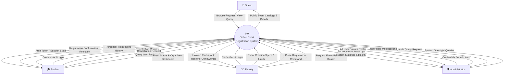

# Level-0 Data Flow Diagram (Context Diagram)

```mermaid
flowchart TD
    %% External Entities
    Guest["👤 Guest"]
    Student["🎓 Student"]
    Faculty["👨‍🏫 Faculty"]
    Admin["🛡️ Administrator"]

    %% Main System Process
    System(("0.0<br/>Online Event<br/>Registration System"))

    %% Data Flows: Guest
    Guest -->|"Browse Request / View Query"| System
    System -->|"Public Event Catalogs & Details"| Guest

    %% Data Flows: Student
    Student -->|"Credentials / Login"| System
    Student -->|"Registration Request"| System
    Student -->|"Cancellation Request"| System
    Student -->|"Query Own Registrations"| System
    System -->|"Auth Token / Session State"| Student
    System -->|"Registration Confirmation / Rejection"| Student
    System -->|"Personal Registrations History"| Student

    %% Data Flows: Faculty
    Faculty -->|"Credentials / Login"| System
    Faculty -->|"Event Creation Specs & Limits"| System
    Faculty -->|"Close Registration Command"| System
    Faculty -->|"Request Event Participant Roster"| System
    System -->|"Event Status & Organizers Dashboard"| Faculty
    System -->|"Isolated Participant Rosters (Own Events)"| Faculty

    %% Data Flows: Admin
    Admin -->|"Credentials / Admin Auth"| System
    Admin -->|"User Role Modifications"| System
    Admin -->|"Audit Query Request"| System
    Admin -->|"System Oversight Queries"| System
    System -->|"System Statistics & Health"| Admin
    System -->|"Security Audit Trail Logs"| Admin
    System -->|"All User Profiles Roster"| Admin
```
