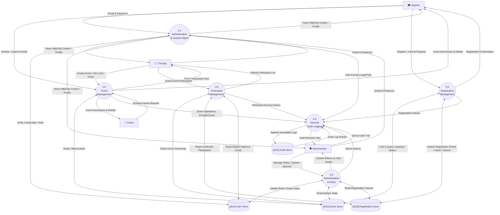

# Level-1 Data Flow Diagram (DFD)

```mermaid
flowchart TD
    %% Entities
    Student["🎓 Student"]
    Faculty["👨‍🏫 Faculty"]
    Admin["🛡️ Administrator"]
    Guest["👤 Guest"]

    %% Data Stores
    D1[("[(D1)] User Store")]
    D2[("[(D2)] Event Store")]
    D3[("[(D3)] Registration Store")]
    D4[("[(D4)] Audit Store")]

    %% Processes
    P1(("1.0<br/>Authentication<br/>& Session Mgmt"))
    P2(("2.0<br/>Event<br/>Management"))
    P3(("3.0<br/>Registration<br/>Management"))
    P4(("4.0<br/>Participant<br/>Management"))
    P5(("5.0<br/>Administration<br/>& Roles"))
    P6(("6.0<br/>Security<br/>Audit Logging"))

    %% Data Flows: Authentication
    Student -->|"Email & Password"| P1
    Faculty -->|"Email & Password"| P1
    Admin -->|"Email & Password"| P1
    P1 <-->|"Verify Credentials / Role"| D1
    P1 -->|"Issue HttpOnly Cookie / Profile"| Student
    P1 -->|"Issue HttpOnly Cookie / Profile"| Faculty
    P1 -->|"Issue HttpOnly Cookie / Profile"| Admin
    P1 -->|"Auth Events (Login/Fail)"| P6

    %% Data Flows: Event Management
    Guest -->|"Browse Events Request"| P2
    Student -->|"Browse / Search Events"| P2
    Faculty -->|"Create Event / Set Limit / Close"| P2
    P2 <-->|"Read / Write Events"| D2
    P2 -->|"Event Summaries & Details"| Guest
    P2 -->|"Event Summaries & Details"| Student
    P2 -->|"Event Ownership Feed"| Faculty
    P2 -->|"Event Operations (Create/Close)"| P6

    %% Data Flows: Registration Management
    Student -->|"Register / Cancel Request"| P3
    P3 <-->|"Lock & Query Capacity / Status"| D2
    P3 <-->|"Unique Registration Check / Insert / Cancel"| D3
    P3 -->|"Registration Confirmation"| Student
    P3 -->|"Registration Actions"| P6

    %% Data Flows: Participant Management
    Faculty -->|"Query Event Participants"| P4
    P4 <-->|"Check Event Ownership"| D2
    P4 <-->|"Read Confirmed Participants"| D3
    P4 <-->|"Read Student Name & Email"| D1
    P4 -->|"Filtered Participant List"| Faculty
    P4 -->|"Participant Access Actions"| P6

    %% Data Flows: Administration
    Admin -->|"Manage Roles / System Queries"| P5
    P5 <-->|"Update Roles / Read Users"| D1
    P5 <-->|"Read System Stats"| D2
    P5 <-->|"Read Registration Volume"| D3
    P5 -->|"System Metrics & User Roster"| Admin
    P5 -->|"Admin Actions"| P6

    %% Data Flows: Audit Logging
    P6 -->|"Append Immutable Logs"| D4
    Admin -->|"Query Audit Trail"| P6
    D4 -->|"Audit Log Stream"| P6
    P6 -->|"Audit Records View"| Admin
```
