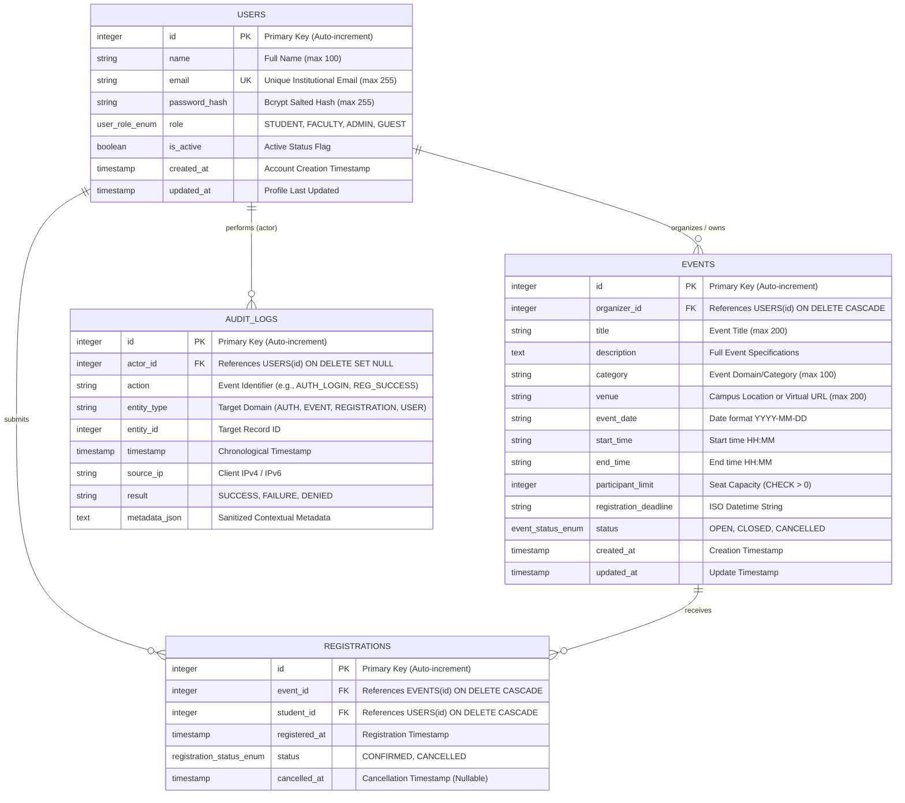

# Entity-Relationship (ER) Diagram

> **Critical Database Security Constraint:**  
> A partial unique index `uq_event_student_active` is enforced on `REGISTRATIONS (event_id, student_id) WHERE status = 'CONFIRMED'`.  
> This guarantees at the database level that no student can ever maintain more than one active confirmed registration for any event.
