# Information Flow Diagram for Sensitive Assets

```mermaid
flowchart TD
    subgraph Flow1 ["Asset 1: User Credentials & Authentication Tokens"]
        ClientCreds["Client Login Form<br/>(email, plaintext password)"]
        IngressTLS["TLS 1.3 Ingress Termination"]
        AuthProc["AuthService.authenticate_user<br/>- Verify with Bcrypt (constant time)<br/>- Issue signed JWT"]
        DBStoreUsers[("users table<br/>password_hash ONLY (bcrypt salted)")]
        SetCookie["HttpOnly Secure Cookie<br/>(access_token, SameSite=Lax)"]

        ClientCreds -->|"HTTPS POST /api/auth/login"| IngressTLS
        IngressTLS --> AuthProc
        AuthProc <-->|"Query hashed string"| DBStoreUsers
        AuthProc -->|"Set-Cookie header"| SetCookie
        SetCookie -.->|"Stored by Browser; Invisible to JS"| ClientCreds
    end

    subgraph Flow2 ["Asset 2: Registration & Participant Data"]
        StudentActor["Student Client"]
        RegProc["RegistrationService<br/>- Row lock & capacity check<br/>- Object-level ownership check"]
        DBStoreReg[("registrations table<br/>(id, event_id, student_id, status)")]
        FacultyActor["Faculty Organizer Client"]

        StudentActor -->|"POST /api/events/{id}/register"| RegProc
        RegProc <-->|"Atomic Lock & Insert"| DBStoreReg
        RegProc -->|"Only own registration returned"| StudentActor
        FacultyActor -->|"GET /api/events/{id}/participants"| RegProc
        RegProc -->|"Filtered list (Only for events owned by faculty)"| FacultyActor
    end

    subgraph Flow3 ["Asset 3: Security & Audit Trail Data"]
        SystemEvents["Application Core Events<br/>(Logins, RBAC blocks, Reg, Cancels)"]
        AuditPipeline["AuditService.log_event<br/>- Sanitize secrets/passwords<br/>- Attach client IP & timestamp"]
        DBStoreAudit[("audit_logs table<br/>(actor_id, action, result, timestamp, ip)")]
        AdminViewer["Admin Dashboard Inspector"]

        SystemEvents --> AuditPipeline
        AuditPipeline -->|"Append-Only Insert"| DBStoreAudit
        DBStoreAudit -->|"GET /api/admin/audit-logs"| AdminViewer
    end
```

### Information Flow Security Constraints
1. **Credentials:** Plaintext passwords are never persisted to disk, never logged in log files or audit tables, and never returned in API serialization payloads (`UserOut` schema explicitly excludes password fields).
2. **Participant Data:** Roster data containing student identities is strictly isolated to the specific faculty member who created the event and the system administrator. Other faculty and students are rejected with HTTP 403.
3. **Audit Data:** Append-only record stream. All log functions strip keys containing `password`, `token`, `secret`, `auth`, and `cred` before writing to `audit_logs.metadata_json`.
