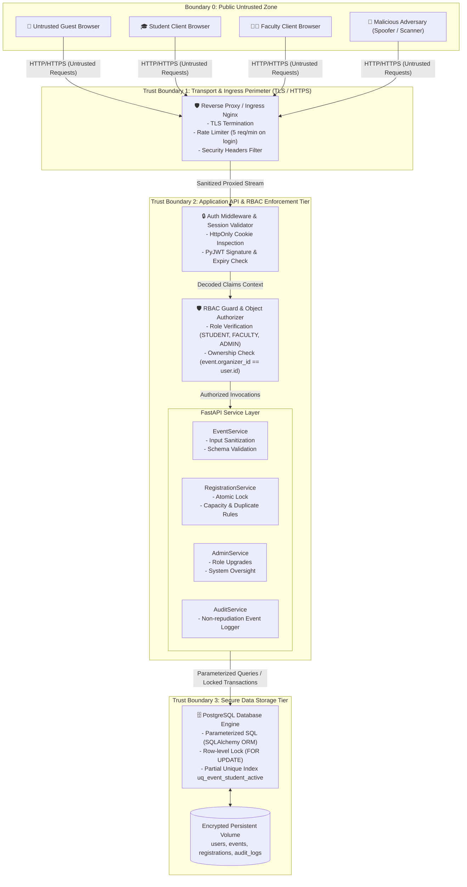

# Trust Boundaries Diagram

### Trust Boundary Analysis
| Boundary | Name | Trust Transition | Enforced Security Controls |
| :--- | :--- | :--- | :--- |
| **TB-0 / TB-1** | Perimeter Boundary | Untrusted Internet $\rightarrow$ Ingress | TLS/HTTPS encryption, Rate limiting, CORS origin restrictions, OWASP security headers (CSP, HSTS). |
| **TB-1 / TB-2** | Application Boundary | Ingress $\rightarrow$ API Gateway | Cryptographic JWT verification, HttpOnly cookie extraction, Pydantic input schema validation. |
| **TB-2 / TB-3** | Internal Auth Boundary | API Layer $\rightarrow$ Core Services | Role-Based Access Control (RBAC), Object-level ownership validation (IDOR defense), Least privilege execution. |
| **TB-3 / TB-4** | Persistence Boundary | Service Layer $\rightarrow$ PostgreSQL | SQLAlchemy parameterized queries (SQLi prevention), Database transactional row locking, Database unique constraints. |
