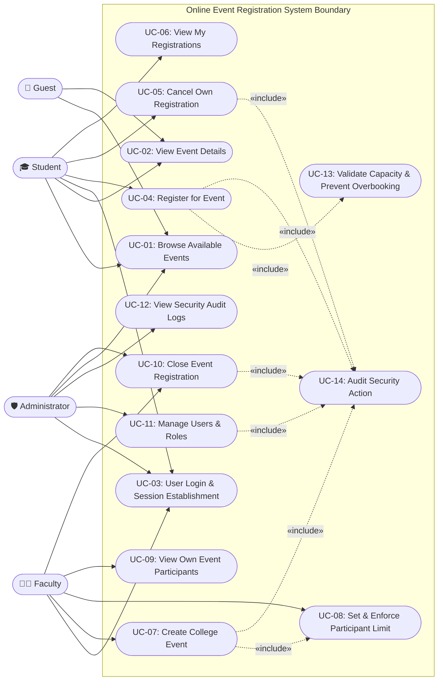

# UML Use Case Diagram

```mermaid
flowchart LR
    %% Actors
    Guest(["👤 Guest"])
    Student(["🎓 Student"])
    Faculty(["👨‍🏫 Faculty"])
    Admin(["🛡️ Administrator"])

    %% Use Cases
    subgraph Boundary ["Online Event Registration System Boundary"]
        UC01(["UC-01: Browse Available Events"])
        UC02(["UC-02: View Event Details"])
        UC03(["UC-03: User Login & Session Establishment"])
        UC04(["UC-04: Register for Event"])
        UC05(["UC-05: Cancel Own Registration"])
        UC06(["UC-06: View My Registrations"])
        UC07(["UC-07: Create College Event"])
        UC08(["UC-08: Set & Enforce Participant Limit"])
        UC09(["UC-09: View Own Event Participants"])
        UC10(["UC-10: Close Event Registration"])
        UC11(["UC-11: Manage Users & Roles"])
        UC12(["UC-12: View Security Audit Logs"])
        UC13(["UC-13: Validate Capacity & Prevent Overbooking"])
        UC14(["UC-14: Audit Security Action"])
    end

    %% Actor Relationships
    Guest --> UC01
    Guest --> UC02

    Student --> UC01
    Student --> UC02
    Student --> UC03
    Student --> UC04
    Student --> UC05
    Student --> UC06

    Faculty --> UC03
    Faculty --> UC07
    Faculty --> UC08
    Faculty --> UC09
    Faculty --> UC10

    Admin --> UC03
    Admin --> UC11
    Admin --> UC12
    Admin --> UC01
    Admin --> UC10

    %% Include / Extend relationships
    UC04 -.->|«include»| UC13
    UC04 -.->|«include»| UC14
    UC05 -.->|«include»| UC14
    UC07 -.->|«include»| UC08
    UC07 -.->|«include»| UC14
    UC10 -.->|«include»| UC14
    UC11 -.->|«include»| UC14
```
