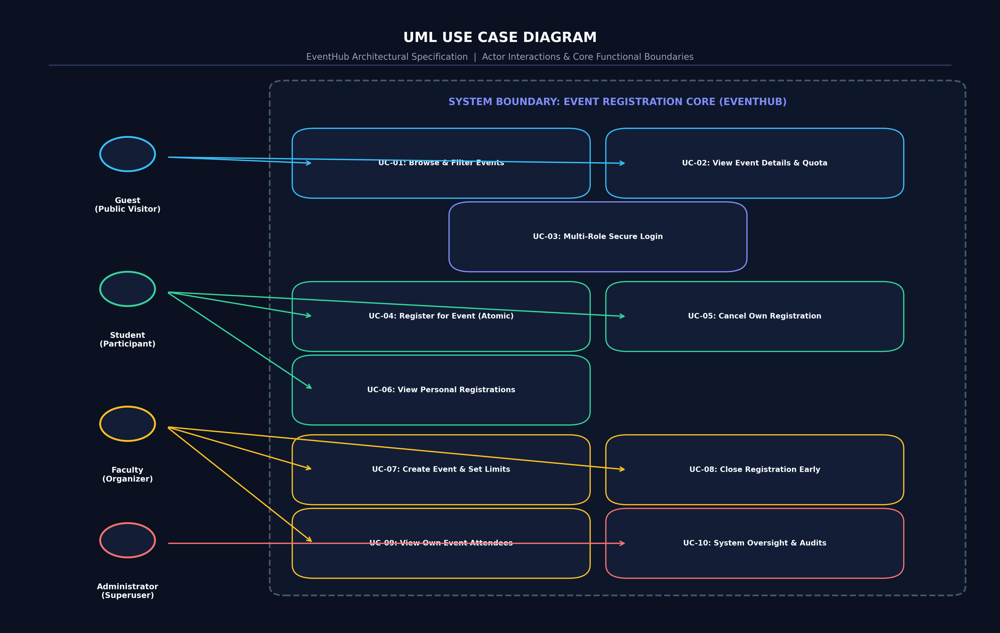
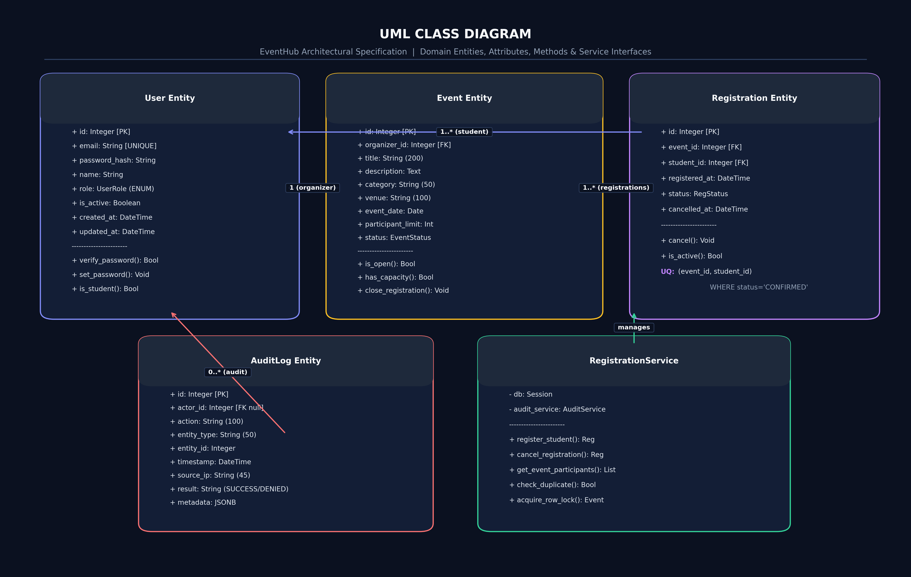
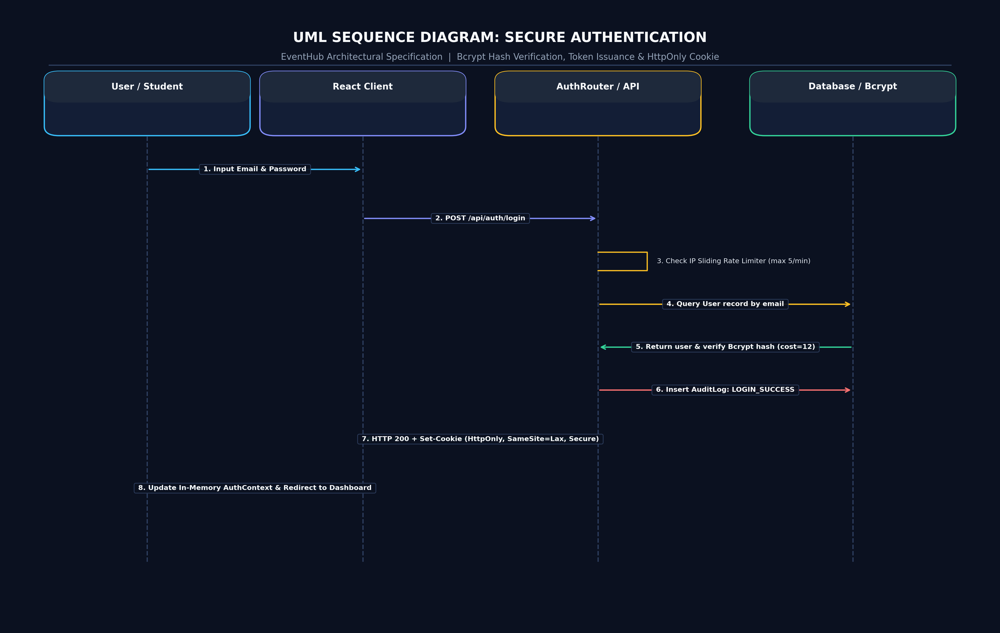
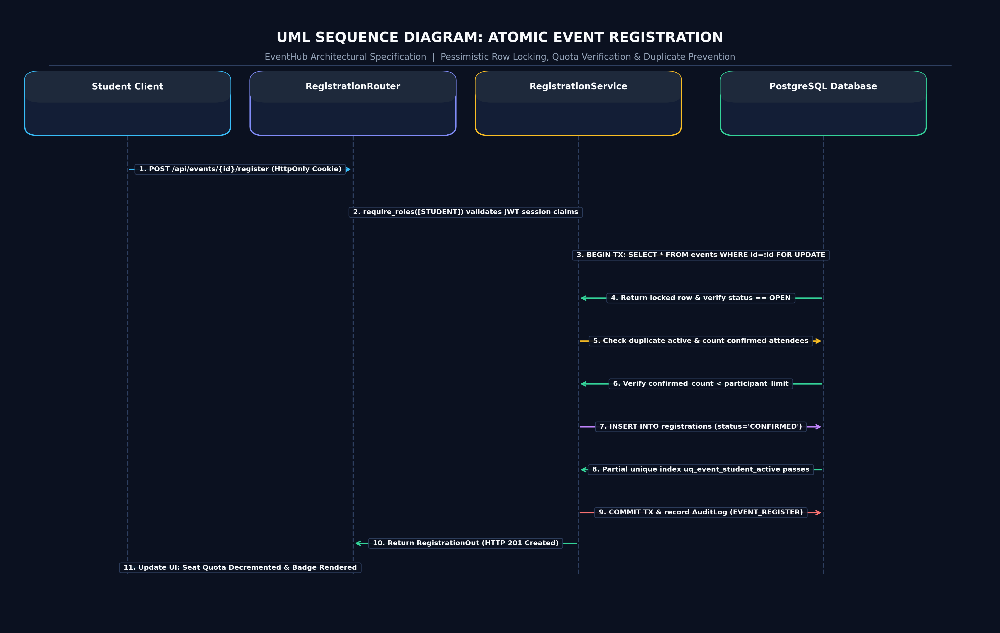
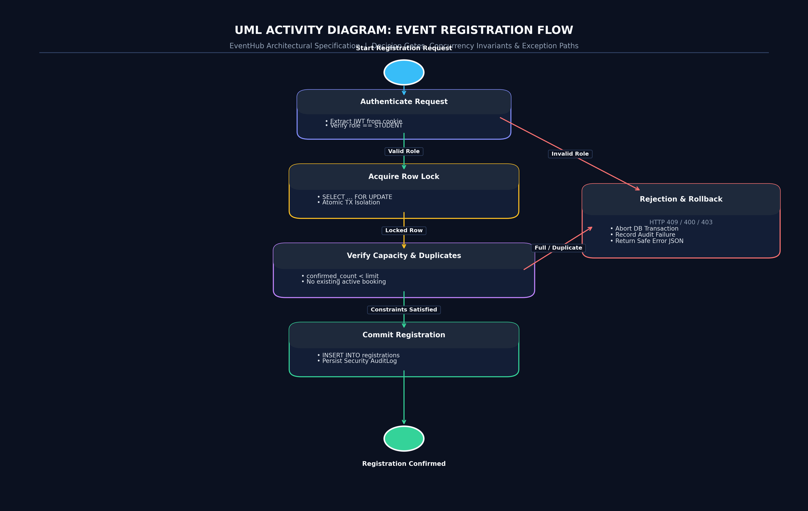

# Phase 3: UML & Requirements Analysis

## 1. UML Use Case Modeling Overview
The use case model formally defines the interactions between human actors and the **Online Event Registration System**. The system bounds four primary actors with strict functional boundaries: **Guest**, **Student**, **Faculty**, and **Administrator**.

### 1.1 Rendered Use Case Diagram

*Vector source: [docs/diagrams/use-case-diagram.svg](file:///d:/Kartheek/WAS/SSE/docs/diagrams/use-case-diagram.svg)*

---

## 2. Detailed Use Case Specification 1: Register for Event (UC-04)

* **Use Case ID:** UC-04
* **Use Case Name:** Register for Event
* **Primary Actor:** Student (`ACT-02`)
* **Secondary Actors:** Database Engine (`SYS-01`), Audit Subsystem (`SYS-02`)
* **Preconditions:**
  1. Student is authenticated with an active session (`role == STUDENT`).
  2. The target event exists and has status `OPEN`.
  3. The current time is prior to the event's registration deadline.
* **Trigger:** Student clicks the "Register Now" button on the Event Details screen and confirms the modal dialog.

### Main Success Scenario (Main Flow):
1. Student navigates to the Event Details page (`/events/{event_id}`).
2. System displays event logistics, current confirmed attendance count, and available seat capacity.
3. Student clicks "Register Now for this Event".
4. System displays a confirmation modal with event title, venue, and date/time.
5. Student confirms the dialog.
6. Client issues a `POST /api/events/{event_id}/register` request with the secure HttpOnly cookie.
7. System verifies the JWT authentication token and extracts `student_id`.
8. System initiates an atomic database transaction and acquires an exclusive row lock on the target event record (`SELECT ... FOR UPDATE`).
9. System verifies:
   - Event status is `OPEN`.
   - Student does not already have an active registration (`status == 'CONFIRMED'`).
   - Current confirmed attendee count is strictly less than `participant_limit`.
10. System creates a new record in `registrations` with status `CONFIRMED` and timestamp `now()`.
11. System commits the transaction, atomically releasing the row lock.
12. System records an audit log entry: `EVENT_REGISTRATION_SUCCESS`.
13. System returns HTTP 201 Created with the registration confirmation payload.
14. Client updates the UI, decrementing available capacity and displaying "✓ You are Registered".

### Alternative Flows:
* **AF-1 (Student previously cancelled this registration):** In step 9, if the student had a previous registration marked `CANCELLED`, the system reactivates the existing record by transitioning status to `CONFIRMED`, clearing `cancelled_at`, and updating `registered_at`.

### Exception Flows:
* **EF-1 (Unauthenticated Request):** In step 7, if no valid session cookie is presented, system terminates with HTTP 401 Unauthorized. UI prompts the user to sign in.
* **EF-2 (Unauthorized Role - Faculty or Admin attempting student registration):** In step 7, if the actor's role is not `STUDENT` or `ADMIN`, system returns HTTP 403 Forbidden with audit logging.
* **EF-3 (Event Capacity Full):** In step 9, if `confirmed_count >= participant_limit`, system aborts transaction, logs `REGISTRATION_CAPACITY_EXCEEDED`, and returns HTTP 400 Bad Request ("Event capacity reached"). UI disables the register button.
* **EF-4 (Duplicate Registration Detected):** In step 9, if an active registration already exists for this `(event_id, student_id)`, system aborts transaction, logs `REGISTRATION_DUPLICATE_ATTEMPT`, and returns HTTP 409 Conflict.
* **EF-5 (Concurrent Race Collision - DB Unique Constraint):** If two concurrent requests slip past application checks simultaneously, the database partial unique index `uq_event_student_active` rejects the second insert with an `IntegrityError`. System catches the exception, rolls back transaction, and returns HTTP 409 Conflict.

### Postconditions:
* A confirmed registration record exists linked to the student and event.
* The available capacity for the event is decremented by 1.
* A tamper-evident audit record is persisted in `audit_logs`.

### Security Considerations:
* **Atomic Concurrency Protection:** Employs row-level locking to prevent race-condition overbooking.
* **Database Unique Index:** Guarantees duplicate prevention even under concurrent distributed requests.
* **Actor Isolation:** `student_id` is derived strictly from the cryptographically verified JWT session claims, never from client-supplied request body parameters (preventing student impersonation).

---

## 3. Detailed Use Case Specification 2: Create & Manage Event (UC-07)

* **Use Case ID:** UC-07
* **Use Case Name:** Create & Manage Event
* **Primary Actor:** Faculty (`ACT-03`)
* **Secondary Actor:** System Administrator (`ACT-04`), Audit Subsystem (`SYS-02`)
* **Preconditions:**
  1. Actor is authenticated with role `FACULTY` or `ADMIN`.
* **Trigger:** Faculty member navigates to `/create-event` and submits the event creation form.

### Main Success Scenario (Main Flow):
1. Faculty enters event title, description, category, venue, date, start/end times, participant limit, and deadline.
2. Client performs client-side field validation and submits `POST /api/events`.
3. System verifies that `current_user.role` is `FACULTY` or `ADMIN`.
4. System validates inputs using Pydantic schema:
   - `participant_limit` is integer $> 0$.
   - Title, description, and venue are non-empty and within bounds.
5. System persists the new event record with `organizer_id = current_user.id` and status `OPEN`.
6. System logs audit event `EVENT_CREATED`.
7. System returns HTTP 201 Created with the event payload.
8. Client redirects Faculty to the Faculty Hub dashboard.

### Alternative Flows:
* **AF-1 (Close Event Registration):** Faculty navigates to `/manage-events` and clicks "Close Registration". System verifies that `event.organizer_id == current_user.id` (or `ADMIN`), updates status to `CLOSED`, logs `EVENT_CLOSED`, and returns HTTP 200.
* **AF-2 (Update Event Logistics):** Faculty updates venue or participant limit. System validates that the new limit is $\ge$ currently confirmed attendees, applies update, and commits.

### Exception Flows:
* **EF-1 (Unauthorized Actor):** A student attempts `POST /api/events` or `POST /api/events/{id}/close`. System rejects with HTTP 403 Forbidden and logs `RBAC_ACCESS_DENIED`.
* **EF-2 (IDOR / Ownership Violation):** Faculty A attempts `PUT /api/events/{event_b_id}` or `POST /api/events/{event_b_id}/close` on an event created by Faculty B. System evaluates `event.organizer_id != current_user.id`, rejects with HTTP 403 Forbidden, and records `UNAUTHORIZED_EVENT_UPDATE_ATTEMPT` in the audit log.
* **EF-3 (Invalid Limit):** Faculty inputs a negative or zero limit. System rejects with HTTP 422 Unprocessable Entity.

---

## 4. UML Class Diagram

*Vector source: [docs/diagrams/class-diagram.svg](file:///d:/Kartheek/WAS/SSE/docs/diagrams/class-diagram.svg)*

---

## 5. Sequence & Activity Interaction Models

### 5.1 Sequence Diagram: Secure Authentication Flow

### 5.2 Sequence Diagram: Atomic Event Registration

### 5.3 Activity Diagram: Student Event Registration Workflow

