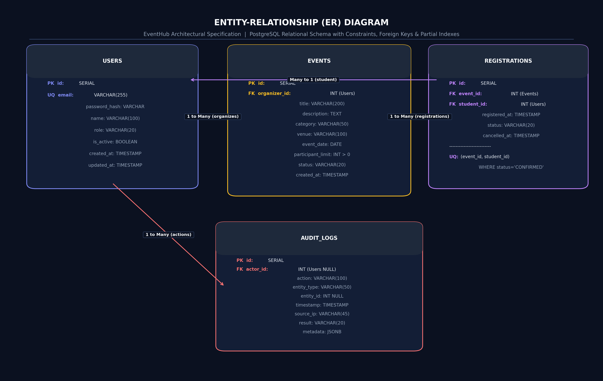
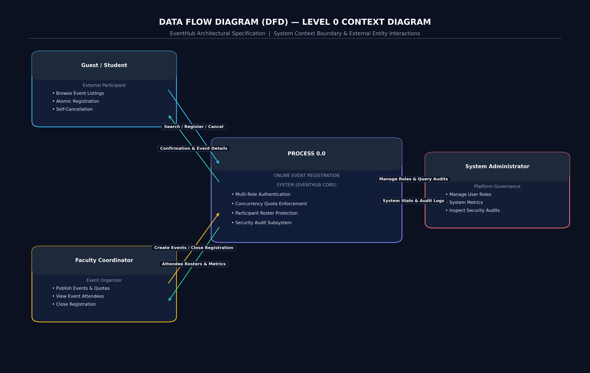
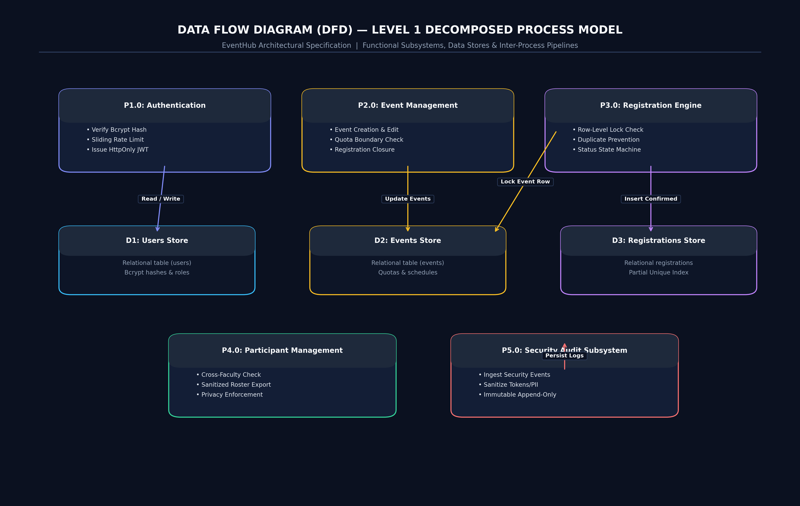
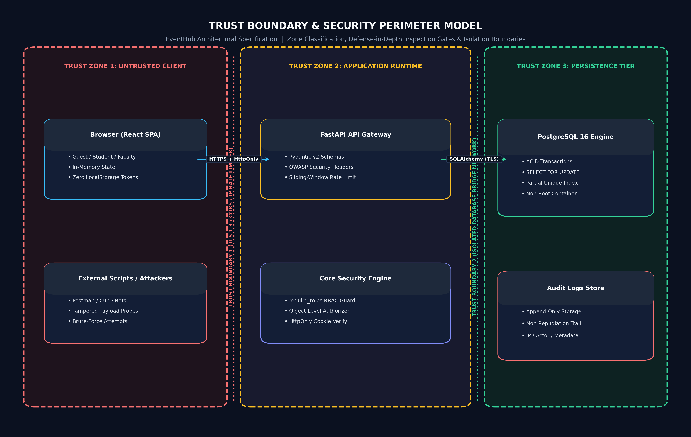

# Phase 4: ER Data Modeling, Data Flow Analysis & Trust Boundaries

## 1. Entity-Relationship (ER) Data Model
The persistence architecture is built on a fully normalized, relational schema implemented in PostgreSQL 16. The entity model maintains strict referential integrity, check constraints, and partial unique indexes to guarantee business rules at the persistence tier.

### 1.1 Rendered ER Diagram

*Vector source: [docs/diagrams/er-diagram.svg](file:///d:/Kartheek/WAS/SSE/docs/diagrams/er-diagram.svg)*

### 1.2 Entity Dictionary & Schema Invariants

| Entity | Primary Key | Foreign Keys | Key Constraints & Invariants | Security Notes |
| :--- | :--- | :--- | :--- | :--- |
| **`users`** | `id` (SERIAL) | None | `email` (UNIQUE, NOT NULL), `role` (ENUM: STUDENT, FACULTY, ADMIN, GUEST) | Stores Bcrypt salted hashes (`password_hash`), never plaintext. `is_active` flag supports instantaneous account deactivation. |
| **`events`** | `id` (SERIAL) | `organizer_id` $\rightarrow$ `users(id)` ON DELETE CASCADE | `CHECK (participant_limit > 0)`, `status` (ENUM: OPEN, CLOSED, CANCELLED) | Event limits enforced by check constraint. Cascade delete ensures orphaned event records are eliminated cleanly. |
| **`registrations`** | `id` (SERIAL) | `event_id` $\rightarrow$ `events(id)` ON DELETE CASCADE, `student_id` $\rightarrow$ `users(id)` ON DELETE CASCADE | **Partial Unique Index:** `UNIQUE(event_id, student_id) WHERE status = 'CONFIRMED'` | Eliminates duplicate active registrations at the database engine level. Tracks cancellation timestamp for auditing. |
| **`audit_logs`** | `id` (SERIAL) | `actor_id` $\rightarrow$ `users(id)` ON DELETE SET NULL | `timestamp` (NOT NULL, indexed), `result` (SUCCESS, FAILURE, DENIED) | Append-only security audit trail. Captures client IP, action, entity type, and sanitized metadata without sensitive secrets. |

---

## 2. Data Flow Diagram (DFD) Analysis

### 2.1 Level-0 DFD (System Context Diagram)
The Context Diagram establishes the macroscopic boundary of the system, illustrating data inputs and outputs between external entities (**Guest**, **Student**, **Faculty**, and **Administrator**) and the core application boundary.

*Vector source: [docs/diagrams/dfd-level-0.svg](file:///d:/Kartheek/WAS/SSE/docs/diagrams/dfd-level-0.svg)*

### 2.2 Level-1 DFD (Decomposed Process Model)
The system is decomposed into 5 discrete, cohesive functional processes interacting with 3 relational data stores and 1 audit store:
1. **Process 1.0 (Authentication & Session Management):** Validates credentials against `D1 (User Store)`, enforces rate limiting, issues cryptographically signed JWT cookies, and reports security events to `Process 5.0`.
2. **Process 2.0 (Event Management):** Receives event specifications from Faculty, handles updates, evaluates object ownership, and coordinates with `D2 (Event Store)`.
3. **Process 3.0 (Registration Management):** Performs atomic locking on `D2 (Event Store)`, verifies capacity, queries and inserts into `D3 (Registration Store)`, and logs registration outcomes.
4. **Process 4.0 (Participant Management):** Enforces object authorization to ensure Faculty only view participant rosters for their own events. Joins `D3 (Registration Store)` with `D1 (User Store)` to produce sanitized participant rosters.
5. **Process 5.0 (Audit & Security Logging):** Ingests security-relevant events across all modules, sanitizes metadata, and writes immutable records to `D4 (Audit Store)`.

*Vector source: [docs/diagrams/dfd-level-1.svg](file:///d:/Kartheek/WAS/SSE/docs/diagrams/dfd-level-1.svg)*

---

## 3. Trust Boundary Identification & Threat Surface Analysis
The architectural topology defines critical **Trust Boundaries (TB)** across client, network, application, and persistence tiers.

*Vector source: [docs/diagrams/trust-boundary-diagram.svg](file:///d:/Kartheek/WAS/SSE/docs/diagrams/trust-boundary-diagram.svg)*

### 3.1 Boundary Invariants & Enforcement Mechanisms

1. **Trust Boundary 1 (Client to Ingress / Application Perimeter):**
   - *Threats:* Man-in-the-Middle eavesdropping, credential stuffing, DDoS on login, cross-origin request forgery.
   - *Enforced Controls:* HTTPS/TLS encryption, CORS origin whitelisting (`ALLOWED_ORIGINS`), in-memory sliding-window rate limiting (5 attempts/min), and strict OWASP security headers.
2. **Trust Boundary 2 (Ingress to API Layer & Services):**
   - *Threats:* Token tampering, session spoofing, malformed payloads, buffer overruns.
   - *Enforced Controls:* PyJWT cryptographic signature verification (HS256 with 256-bit secret), cookie `HttpOnly` and `SameSite=Lax` flags, and Pydantic schema validation.
3. **Trust Boundary 3 (Service Tier to Relational Database):**
   - *Threats:* SQL Injection, race-condition overbooking, duplicate registration insertions.
   - *Enforced Controls:* SQLAlchemy parameterized ORM queries, row-level locking (`SELECT ... FOR UPDATE`), and PostgreSQL partial unique indexes (`uq_event_student_active`).

---

## 4. Sensitive Information Flow Analysis

*Vector source: [docs/diagrams/information-flow-diagram.svg](file:///d:/Kartheek/WAS/SSE/docs/diagrams/information-flow-diagram.svg)*
