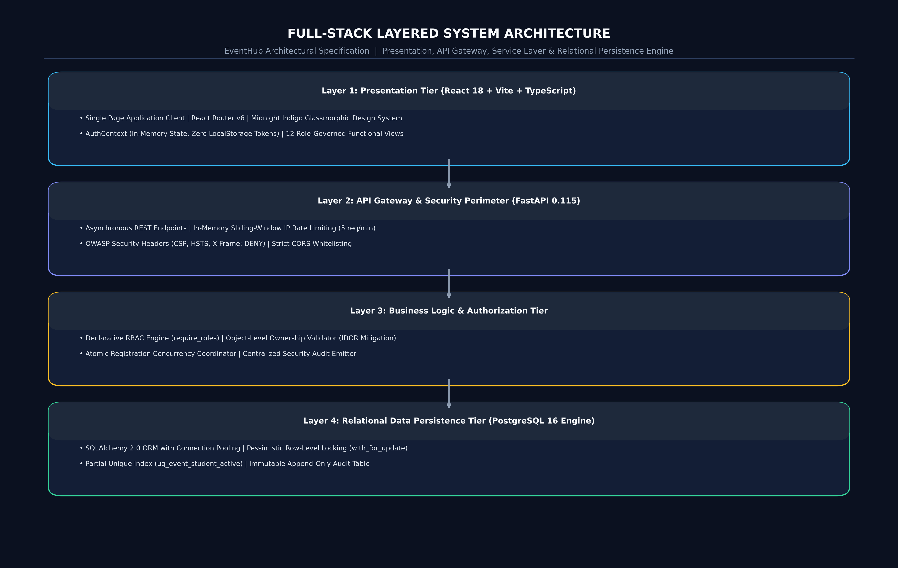
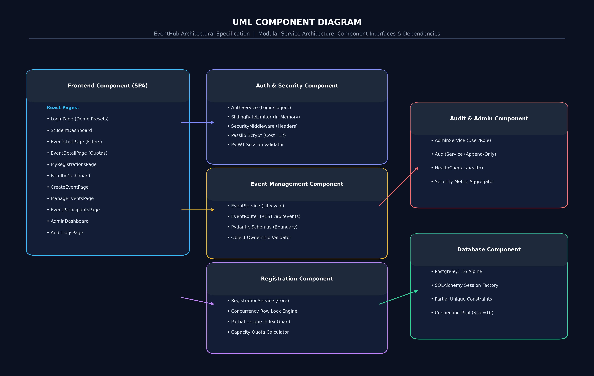
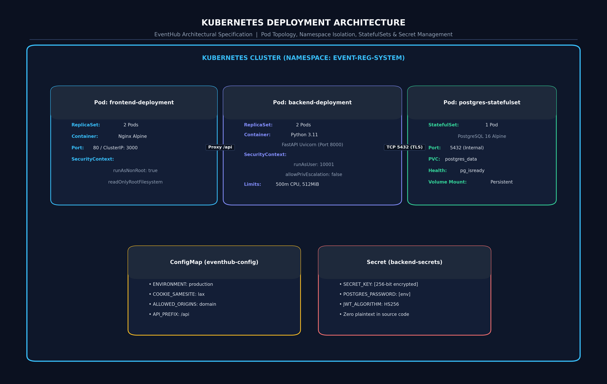

# Phase 5: Software Architecture & Detailed Design

## 1. Architectural Strategy & Technology Stack
The **Online Event Registration System** is engineered using an enterprise **Layered Micro-Tier Architecture** ensuring high cohesion, low coupling, deterministic security boundaries, and complete separation of concerns.

### 1.1 Rendered System Architecture

*Vector source: [docs/diagrams/system-architecture.svg](file:///d:/Kartheek/WAS/SSE/docs/diagrams/system-architecture.svg)*

---

## 2. Component Architecture & Detailed Modules

*Vector source: [docs/diagrams/component-diagram.svg](file:///d:/Kartheek/WAS/SSE/docs/diagrams/component-diagram.svg)*

### 2.1 Component Mapping to System Requirements

| Requirement Domain | Responsible Components | Architectural Responsibility |
| :--- | :--- | :--- |
| **1. Authentication** | `api/auth.py`, `services/auth_service.py`, `core/security.py`, `core/rate_limit.py` | Handles credential verification, Bcrypt salted hashing, sliding-window rate limiting, and secure HttpOnly JWT issuance. |
| **2. Event Management** | `api/events.py`, `services/event_service.py`, `models/event.py` | Governs event lifecycle (create, list, search, filter, update, close) and validates input boundaries and participant caps. |
| **3. Registration** | `api/registrations.py`, `services/registration_service.py`, `models/registration.py` | Coordinates atomic registrations, checks event status and capacity, acquires row-level locks, and prevents duplicate records. |
| **4. Participant Viewing** | `api/registrations.py`, `services/registration_service.py` | Enforces object-level authorization ensuring Faculty members inspect participants *only for their own events*; sanitizes attendee rosters. |
| **5. Results & Status** | `api/events.py`, `api/registrations.py`, `services/event_service.py` | Calculates real-time registration capacity, available seat counts, and personalized registration states (`is_registered_by_user`). |
| **6. Audit & Logging** | `api/admin.py`, `services/audit_service.py`, `core/middleware.py`, `models/audit_log.py` | Structured append-only security auditing of all lifecycle actions, authorization denials, and admin role adjustments. |
| **7. Monitoring & Health**| `api/health.py` | Liveness and readiness probe validating database connectivity and service responsiveness for Kubernetes / Docker. |

---

## 3. Core Software Design Patterns Applied

### Pattern 1: Layered Architecture (Multi-Tier)
Organizes the software into distinct horizontal layers: Presentation, API Routing, Business Services, Data Access, and Database. Enforces strict separation of concerns; the React client never communicates directly with the database; API controllers handle only protocol routing and serialization; business services execute pure domain rules.

### Pattern 2: Service Layer Pattern
Encapsulates business logic, transactional boundaries, and operational workflows into dedicated service classes (`RegistrationService`, `EventService`, `AuthService`). Prevents "Fat Controller" code rot. API routes delegate transactional concurrency, row locking, and duplicate verification directly to the service layer.

### Pattern 3: Dependency Injection (DI)
FastAPI's `Depends()` framework enables declarative, composable security guards. Routes declare requirements such as `current_user: User = Depends(require_roles([UserRole.FACULTY]))`, centralizing authentication, role verification, and database session lifecycle management.

### Pattern 4: Data Transfer Object (DTO) / Schema Validation
Implemented via Pydantic v2 (`schemas/user.py`, `schemas/event.py`). Incoming JSON payloads are strictly validated for type safety, length bounds, and positive integers before reaching services. Outgoing schemas (`UserOut`) explicitly exclude sensitive attributes (`password_hash`), preventing inadvertent credential leakage.

### Pattern 5: Role-Based Access Control (RBAC) & Object Authorization
Access decisions are determined by the actor's system role (Student, Faculty, Admin), coupled with runtime ownership checks against the target entity (`event.organizer_id == current_user.id` or `reg.student_id == current_user.id`).

---

## 4. Deployment Architecture (Kubernetes / Minikube)

*Vector source: [docs/diagrams/deployment-diagram.svg](file:///d:/Kartheek/WAS/SSE/docs/diagrams/deployment-diagram.svg)*
