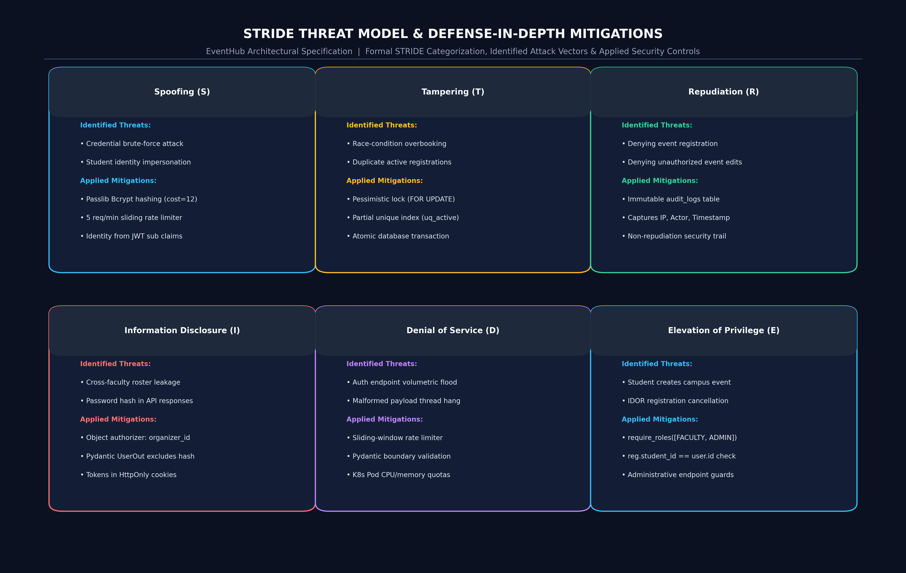
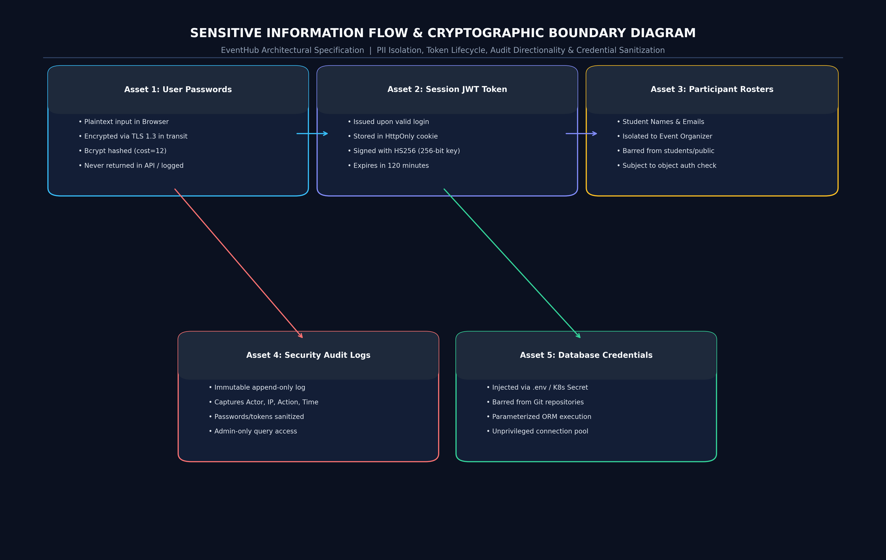

# Phase 7: Threat Modeling, STRIDE Analysis & Security Analysis

## 1. Asset Inventory & CIA Classification
The system identifies 10 critical assets across the application lifecycle.

| # | Asset Name | Description & Storage Location | C | I | A | Security Justification |
| :- | :--- | :--- | :-: | :-: | :-: | :--- |
| **AST-01** | **User Credentials** | Plaintext login passwords submitted during authentication. | **H** | **H** | **M** | Compromise leads to total account takeover and student/faculty impersonation. |
| **AST-02** | **Authentication Tokens / Sessions** | Signed PyJWT access tokens stored in browser cookies. | **H** | **H** | **H** | Theft allows adversary to bypass login and act on behalf of the victim. |
| **AST-03** | **User Identity & Profiles** | Institutional records stored in `users` (Name, Email, Role). | **M** | **H** | **M** | Identity integrity must be preserved for access decisions. |
| **AST-04** | **Event Specifications & Limits** | Title, venue, schedule, and participant limits in `events`. | **L** | **H** | **H** | Tampering with limits disrupts campus capacity planning. |
| **AST-05** | **Registration Records** | Confirmed bookings linking students to events in `registrations`. | **M** | **H** | **H** | Core business asset; must remain consistent and duplicate-free. |
| **AST-06** | **Participant Roster Data** | Aggregated list of students attending a specific event. | **H** | **H** | **M** | Student personal privacy protection against mass data harvesting. |
| **AST-07** | **Administrative Privileges** | Superuser capabilities granting role alteration and oversight. | **H** | **H** | **H** | Unauthorized escalation allows malicious takeover of the entire system. |
| **AST-08** | **Security Audit Logs** | Tamper-evident records in `audit_logs` capturing security actions. | **M** | **H** | **M** | Non-repudiation and forensic accountability. |
| **AST-09** | **Database Credentials** | PostgreSQL connection strings and passwords in `.env` / K8s Secrets. | **H** | **H** | **H** | Exposure allows direct database manipulation bypassing application logic. |
| **AST-10** | **Application Cryptographic Key** | 256-bit JWT signing secret key (`SECRET_KEY`). | **H** | **H** | **H** | Compromise enables arbitrary forgery of valid JWTs for any role. |

*(C: Confidentiality, I: Integrity, A: Availability; H=High, M=Medium, L=Low)*

---

## 2. Comprehensive STRIDE Threat Analysis

### 2.1 Rendered STRIDE Threat Matrix

*Vector source: [docs/diagrams/threat-model.svg](file:///d:/Kartheek/WAS/SSE/docs/diagrams/threat-model.svg)*

### 2.2 Cataloged Threats & Controls

| Threat ID | Threat Description | STRIDE Category | Affected DFD Element | Likelihood | Impact | Risk Rating | Concrete Mitigation Control |
| :--- | :--- | :--- | :--- | :-: | :-: | :-: | :--- |
| **THR-01** | **Credential Brute-Forcing:** Adversary scripts rapid login attempts to guess weak student passwords. | **Spoofing** | Process 1.0 (Auth) | Medium | High | **High** | In-memory sliding-window rate limiting (max 5 failed attempts/min per IP); Bcrypt cost 12. |
| **THR-02** | **Session Hijacking via XSS:** Malicious script running in browser extracts auth tokens. | **Spoofing** | Data Flow: Ingress $\rightarrow$ Client | Low | High | **Medium** | Tokens stored in `HttpOnly` `SameSite=Lax` cookies; strict CSP header blocks unauthorized scripts. |
| **THR-03** | **Student Impersonation via Parameter Tampering:** Attacker supplies another student's ID in registration body. | **Spoofing** | Process 3.0 (Registration) | Medium | High | **High** | API derives student identity strictly from the verified JWT token claims, ignoring body IDs. |
| **THR-04** | **Unauthorized Event Creation:** Student attempts to create an event via direct API request. | **Elevation of Privilege** | Process 2.0 (Events) | High | High | **High** | Server-side RBAC guard `require_roles([FACULTY, ADMIN])` enforces role before executing route. |
| **THR-05** | **Cross-Faculty Participant Harvesting (IDOR):** Faculty A queries participants of an event owned by Faculty B. | **Information Disclosure** | Process 4.0 (Participants) | High | High | **High** | Object-level authorization evaluates `event.organizer_id == current_user.id`, returning 403 on mismatch. |
| **THR-06** | **Arbitrary Registration Cancellation (IDOR):** Student A sends `DELETE /api/registrations/{reg_b_id}`. | **Tampering** | Process 3.0 (Registration) | High | High | **High** | Object authorization verifies `registration.student_id == current_user.id` before executing cancellation. |
| **THR-07** | **Duplicate Active Registrations:** Student submits multiple simultaneous registrations for the same event. | **Tampering** | Process 3.0 (Registration) | High | Medium | **High** | PostgreSQL partial unique index `uq_event_student_active` combined with atomic query duplicate check. |
| **THR-08** | **Race-Condition Overbooking:** Concurrent requests register for the final seat simultaneously. | **Tampering** | Process 3.0 (Registration) | High | High | **Critical** | Database row locking (`SELECT ... FOR UPDATE`) inside an isolated ACID transaction. |
| **THR-09** | **Audit Log Tampering / Deletion:** Attacker alters audit records to cover tracks. | **Repudiation** | Process 6.0 (Audit) | Low | High | **Medium** | Append-only database permissions; no API endpoint exposes `DELETE` or `PUT` for `audit_logs`. |
| **THR-10** | **SQL Injection in Event Search:** Adversary injects SQL fragments into query parameter `?search=`. | **Tampering** | Process 2.0 (Events) | Medium | High | **High** | SQLAlchemy 2.0 parameterized ORM queries; no raw SQL string formatting. |
| **THR-11** | **Password Leakage in API Responses:** Sensitive hash serialized in user profile payloads. | **Information Disclosure** | Process 1.0 & Process 5.0 | Medium | High | **High** | Pydantic response schemas (`UserOut`) explicitly exclude `password_hash` field. |
| **THR-12** | **Denial of Service on Registration:** Excessive malformed requests exhaust backend worker threads. | **Denial of Service** | Process 3.0 (Registration) | Medium | Medium | **Medium** | Pydantic validation rejects bad inputs immediately at the boundary; container resource limits. |
| **THR-13** | **Vertical Privilege Escalation:** Student calls `PUT /api/admin/users/{id}/role` to elevate own role to Admin. | **Elevation of Privilege** | Process 5.0 (Admin) | High | Critical | **Critical** | Route protected by `require_roles([UserRole.ADMIN])`; audit logs capture attempted elevations. |
| **THR-14** | **Unauthenticated Event Modification:** Anonymous user attempts to close registration via PUT/POST. | **Tampering** | Process 2.0 (Events) | High | High | **High** | Route rejects unauthenticated requests with HTTP 401; rejects non-organizers with HTTP 403. |

---

## 3. Information Flow Security Analysis

*Vector source: [docs/diagrams/information-flow-diagram.svg](file:///d:/Kartheek/WAS/SSE/docs/diagrams/information-flow-diagram.svg)*

1. **User Credentials Flow:** Plaintext passwords transition across Trust Boundary 1 exclusively via TLS 1.3. Upon reaching `AuthService`, passwords are immediately verified using constant-time comparison against Bcrypt salted hashes. Passwords never touch application memory beyond the scope of the authentication function.
2. **Registration & Participant Data Flow:** Participant rosters transition across Trust Boundary 2 only after validating that the requesting user's ID matches `event.organizer_id`. The data flow strictly prevents participant lists from being emitted to standard students or guests.
3. **Audit Log Data Flow:** Audit records flow in a strictly one-way direction into `D4 (Audit Store)`. Logging functions sanitize metadata by removing sensitive keys (`password`, `token`, `secret`, `auth`) before persisting records.

---

## 4. Formal Vulnerability Catalog & Mitigations

| Vuln ID | Vulnerability Description | Affected Element | Associated Threat | Severity | Concrete Mitigation | Automated Verification Method |
| :--- | :--- | :--- | :--- | :-: | :--- | :--- |
| **VUL-01** | Insecure Direct Object Reference (IDOR) on registration cancellation | `DELETE /registrations/{id}` | THR-06 | **High** | Object authorizer: `reg.student_id == current_user.id` | Tested by `test_02_student_a_cannot_cancel_student_b_registration` |
| **VUL-02** | Time-of-Check to Time-of-Use (TOCTOU) Race Condition in Capacity Check | `POST /events/{id}/register` | THR-08 | **Critical** | Row-level locking `with_for_update()` inside atomic transaction | Tested by `test_16_concurrent_registrations_cannot_cause_capacity_overflow` |
| **VUL-03** | Duplicate Registration Bypass via Concurrent Requests | `registrations` table | THR-07 | **High** | DB partial unique index `uq_event_student_active` | Tested by `test_08_student_cannot_register_twice_for_same_event` |
| **VUL-04** | Missing Authorization on Participant Roster (Data Exfiltration) | `GET /events/{id}/participants`| THR-05 | **High** | Combined RBAC + Owner check (`event.organizer_id == user.id`) | Tested by `test_05_faculty_a_cannot_view_faculty_b_participant_list` |
| **VUL-05** | Credential Stuffing / Brute-Force Authentication | `POST /api/auth/login` | THR-01 | **Medium** | Sliding-window in-memory rate limiter (5 max attempts/60s) | Tested by `test_17_authentication_brute_force_attempts_are_controlled` |
| **VUL-06** | Sensitive Data Exposure in API Serialization | `UserOut` schema | THR-11 | **High** | Pydantic model separation with explicit field exclusion | Tested by `test_14_passwords_are_never_returned_by_apis` |
