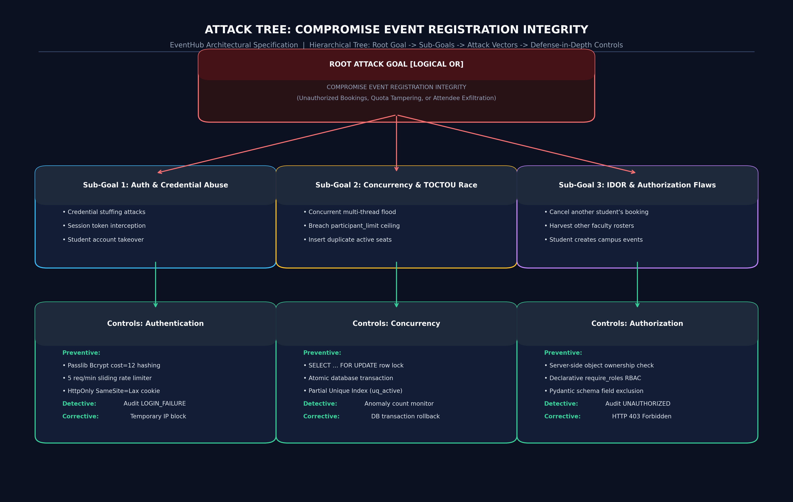
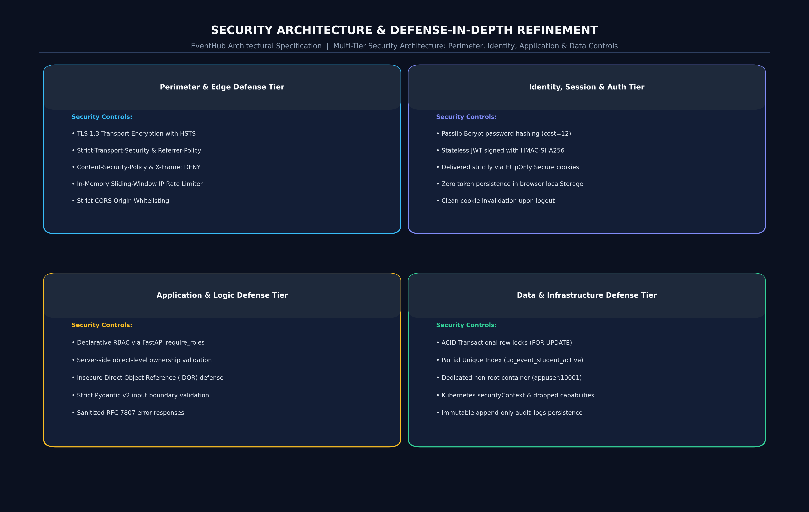

# Phase 8: Attack Tree Analysis & Security Architecture Refinement

## 1. Attack Tree Modeling
To analyze adversarial strategies, we constructed a hierarchical **Attack Tree** targeting the critical root goal: **COMPROMISE EVENT REGISTRATION INTEGRITY** and its high-risk corollary, **EXFILTRATE PARTICIPANT INFORMATION WITHOUT AUTHORIZATION**.

### 1.1 Rendered Attack Tree Diagram


*Vector source: [docs/diagrams/attack-tree.svg](file:///d:/Kartheek/WAS/SSE/docs/diagrams/attack-tree.svg)*

---

## 2. Attack Path Analysis & Control Triage

### Path A: Race-Condition Overbooking (Goal 2: TOCTOU Under Load)
* **Adversary Action:** The attacker monitors an event nearing capacity (e.g., 49/50 seats filled) and scripts rapid, concurrent `POST /api/events/{id}/register` requests across multiple student accounts to force the count past 50.
* **Logic Exploited:** Non-atomic check-then-act sequence where two threads read `count < limit` before either thread inserts.
* **Preventive Control:** Execute registration inside an isolated transaction with row-level locking (`SELECT ... FOR UPDATE` in PostgreSQL; thread mutex lock in application memory). The second thread is blocked until the first thread commits.
* **Detective Control:** Audit log monitoring flags multiple near-instantaneous registration attempts; capacity anomaly check triggers if `confirmed_count > limit`.
* **Corrective Control:** Transactional rollback: the database rejects any insert violating invariants, returning HTTP 400 Bad Request ("Event capacity reached").

---

### Path B: IDOR Cancellation / Manipulation (Goal 3: IDOR Tampering)
* **Adversary Action:** Student A inspects HTTP traffic, observes a registration ID belonging to Student B (`#REG-0002`), and issues a raw HTTP `DELETE /api/registrations/2` using Student A's own session cookie.
* **Logic Exploited:** Reliance on client-supplied ID without verifying ownership of the target resource.
* **Preventive Control:** Object-level authorization in `RegistrationService.cancel_registration`:
  ```python
  if reg.student_id != current_user.id and current_user.role != UserRole.ADMIN:
      raise HTTPException(status_code=403, detail="Forbidden: You can only cancel your own registrations.")
  ```
* **Detective Control:** The audit subsystem logs `UNAUTHORIZED_CANCELLATION_ATTEMPT` with the attacker's user ID, client IP, and target registration ID.
* **Corrective Control:** HTTP 403 Forbidden is returned; the target registration remains untouched.

---

### Path C: Duplicate Registration Exploit
* **Adversary Action:** A student scripts automated registration requests to reserve multiple seats for the same event under a single user identity.
* **Logic Exploited:** Lack of database-level unique constraints, allowing duplicate rows to be inserted.
* **Preventive Control:** Enforced PostgreSQL partial unique index:
  ```sql
  CREATE UNIQUE INDEX uq_event_student_active ON registrations (event_id, student_id) WHERE status = 'CONFIRMED';
  ```
* **Detective Control:** Application catches duplicate attempts and logs `REGISTRATION_DUPLICATE_ATTEMPT` (result: `DENIED`).
* **Corrective Control:** Returns HTTP 409 Conflict ("You are already registered for this event").

---

### Path D: Cross-Faculty Participant Harvesting
* **Adversary Action:** Faculty member A discovers event ID `#1` organized by Faculty member B and issues `GET /api/events/1/participants` to harvest student contact details.
* **Logic Exploited:** Role-based access control alone verifies that the user is `FACULTY`, but fails to evaluate *which* faculty member owns the event.
* **Preventive Control:** Object authorizer verifies:
  ```python
  if event.organizer_id != current_user.id and current_user.role != UserRole.ADMIN:
      raise HTTPException(status_code=403, detail="Forbidden: You can only view participant rosters for your own events.")
  ```
* **Detective Control:** Audit logger captures `UNAUTHORIZED_PARTICIPANT_ACCESS_ATTEMPT`.
* **Corrective Control:** Immediate termination with HTTP 403 Forbidden; zero student personal data is transmitted.

---

## 3. Security Architecture Refinements & Defense-in-Depth



*Vector source: [docs/diagrams/security-architecture.svg](file:///d:/Kartheek/WAS/SSE/docs/diagrams/security-architecture.svg)*

Following the attack tree evaluation, the engineering team executed three critical architectural refinements:
1. **Double-Barreled Duplicate Prevention:** Implemented duplicate prevention at *both* the service query layer and the database index layer. Even if an application bug bypassed the service check, the database engine physically rejects duplicate rows.
2. **Actor Resolution Exclusively from Cryptographic Claims:** The API layer was refactored so that no registration endpoint accepts `student_id` in request payloads. The actor's identity is derived exclusively from verified JWT cookie claims (`payload["sub"]`).
3. **Decoupled Audit Persistence:** Audit logging was decoupled from business transaction failures. If an unauthorized attempt occurs, the primary transaction is aborted, but the security audit log is persisted via an independent transaction commit.
